# How to run this code?

Just open the HTML file into live server. By default index.js will be empty. I added the index.js file in index.html as script tag.

But the code on specific topics of OOP will be separated in specific file. You just need to copy paste the code into index.js

**Then run the index.html into live server and see in the browser console.**

## **Topics**

## 1. What is Object Oriented Programming? (OOP)

### OOP or Object Oriented Programming is a programming paradigm based on concept of objects.Paradigms means writing style of code, how write and organize code.

We use objects to made (describe) real-world or abstract features.

Object may contain data (properties) and code (methods). By using objects, we pack data and the corresponding behavior into one block.

In OOP, objects are self-contained pieces or bock of code.

Object are building blocks of applications, and interact with one another.

OOP was developed with the goal of organizing code, to make it more flexible and easier to maintain.

**In OOP we use class. Class is blueprint from which we can create new objects based on the rules describe in the class.**

**We can make instance from a class. This instance is a real object that we can use in our code which was created from a class. We can't use class because class is not an object.**

For example, consider a **class** as a blueprint of a house and the house we make from that blueprint is the **object**. We are not living in that blueprint of the house, because that doesn't make sense but we can build a house using that blueprint where we can live. Similarly, we can't use class in our code directly instead we build object from that class. Then we use that object in our code. We use one blueprint to build as many house we wanted. Similarly we can create as many as object from a class. Then we can use those object instance differently based on our use cases. Each and every object may has different instance but their functionality is same. Like we can build as many house we need using that blueprint but the purpose of house is giving use shelter.

_The picture below is not the proper code of JavaScript class. It is just for understanding._

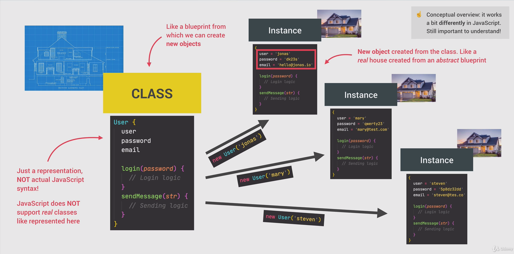

### How can we build a class?

We generally follow four fundamental principles to create a class.

    1. Abstraction
    2. Encapsulation
    3. Inheritance
    4. Polymorphism

## Abstraction:

### Abstraction is ignoring or hiding details that don't matter, allowing us to get an overview perspective of the thing we're implementing, instead of messing with details that don't really matter to our implementation.

This is definition. If we consider a mobile, we don't need to know the mobile inner functionalities like how home button works or how vibration works or how proximity sensors works. We just know that it is a phone, we use that to call someone, capture a picture, watching movies etc. but we don't need to know how those works behind the scene, we don't need to know the implementations details of those features. This is the abstractions.

In programming example, in web development we use `addEventListener()` function , we all know that it listen to the browser event like button click, mouse hover etc. but we don't know how this `addEventListener()` is working behind the scene. That is the abstractions. It hides the implementation details.

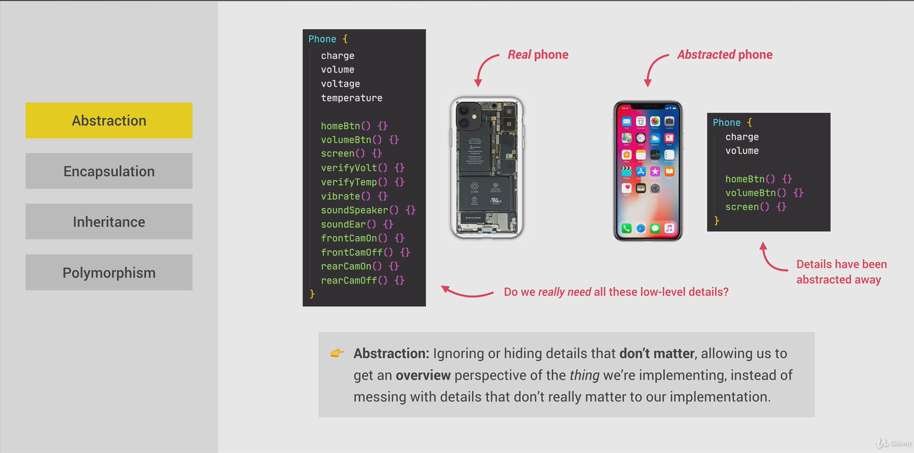

## Encapsulation:

### Encapsulation is keeping properties and methods private inside the class, so they are not accessible from outside the class. Some methods can be exposed as a public interface (API).

So that means there are some properties or methods in a class that we should not give them permission to get modified by the external code. Now this is necessary. For example we have a `checkAuthToken()` method token inside our class which check authentication token. But for some reason if it gets public. Then anywhere from our code we can check the authentication token. That should be a vulnerability issue. So this is why we need encapsulation. We can make the `checkAuthToken()` private so that it can be only accessible inside that class only to check the authentication token.

We public the instance or method which is necessary otherwise make them private. That is Encapsulation.

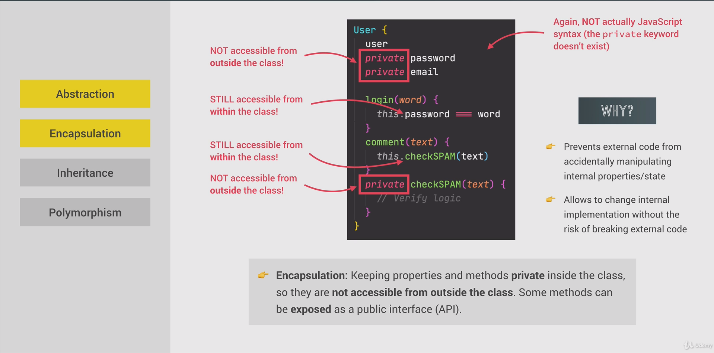

## Inheritance:

### Inheritance is making all properties and methods of a certain class available to a child class, forming a hierarchical relationship between classes. This allows us to reuse common logic and to model real-world relationships.

So in simple example inheritance means which quality or attitude you get from your parents. Suppose your father has anger issues. You also got that. This is how you inherit your father attitude inside you. In programming it also works that way. In the below example though it is not Javascript example I hope you will get the concept:

Suppose we create a website. There we may need two type of user. One is "**user**" which is common and other one is "**admin**". But isn't the **admin** also an **user**? definitely yes. Admin is also an user. But maybe he has some extra power or abilities than an user. That means he must have the common user behavior with added the admin power also. So we can create two scenario to write the code.

**_First Scenario:_**
Like we can create user class with user common properties. Then we create another admin class with **user properties + admin properties**. But writing the user properties in admin class again will be re-writing the code again. So that could be a redundancy of the code.

**_Second scenario:_** Here we can inherit the user properties in admin class and after that we can add some extra properties to the admin class. If we inherit the properties from user class then we don't need to re-write code again I mean we don't need to write the user properties in admin class again because user class is already inherited in admin class. This is how inheritance works in OOP. Just inherit the functionalities and remove code redundancy.

Like I get the attitude from my parents, in OOP admin class inherit the properties from the user class. So here admin is child like me and user is Parent like my father. So this is the concept of inheritance in OOP.

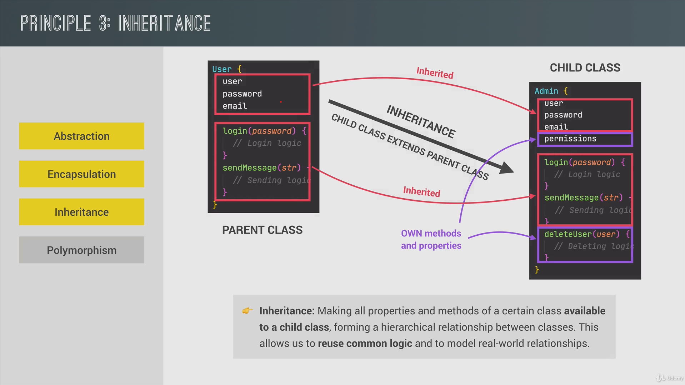

## Polymorphism:

### Polymorphism means many shapes. Polymorphism is when a child class can overwrite a method which is inherited from a parent class [it's more complex that that, but enough for our purposes].

In the previous example we use "**user**" class and "**admin**" class. Where user is the parent class and admin is the child class. Here **Admin** class inherit the behavior of parent class (**User**) because admin is also an user, admin also has the the common behavior what the user has. Now admin has extra abilities. There might be a scenario when admin need to modify user properties like user class `login()` method. For Parent love chicken in meal but without spice. His children also love chicken as he/she inherit his/her parents test buds. But problem is children loves spicy chicken not like their parents. So children though inherit the test of loving chicken from his/her parent but with spicy one. So children add more spice to their chicken. This is how modify his test preference.

Like this admin may also has login features but as he is an admin he need to login more securely. Thats why when he login he need special key to login. But this `login()` method is inherit from parent class (**User**). But **admin** class is using same method with making a small tweak of that login method like below. This is the polymorphism. Same login method is inherited in child class but use it in different shape. One is without extra key (**User Login**), another one is with extra key (**Admin Login**).

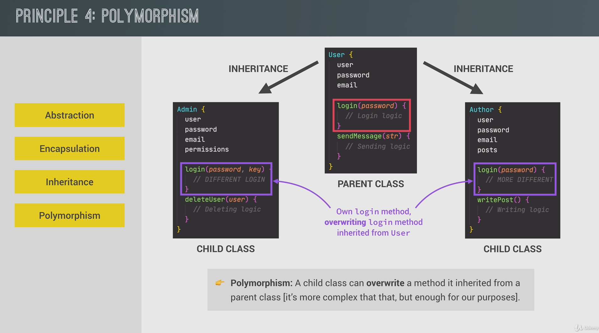

## 2. Constructor Function and New Operator

### 1. What is Constructor Function?

In JavaScript, more precisely in sense of traditional OOP JavaScript doesn't provide class. We can't make class in JavaScript. But we can use **Constructor** function alternatively. We can create object using constructor function in JavaScript. So,

### _Constructor function is used when we build an object using function._

### 2. Difference between constructor function and regular function?

Constructor function is called with **`new`** operator.

```
const samiul = new Person("Samiul", 1991);
```

### 3. How to create a constructor function?

**As OOP convention, to create a construction function we generally use first letter of the function name as Capital.**

```
const Person = function (){
//... code
}
// P is capital
```

**_Arrow function will not work as constructor function because it doesn't has `this` keyword._**

### 4. To call a constructor function we use new keyword.

```
const Person function (firsName, birthYear){
// ... Code
}
new Person('Samiul', 1998)
```

### 5. that **_`new`_** keyword do several things:

    1. New object ==> {} is created. New empty object is created.
    2. function is called.
    3. `this` keyword will point to new object, `this = {}`
    4. that new object `{}` will linked to prototype
    5. function will automatically return {}

### 5.1. New object ==> {} is created. New empty object is created.

```
const Person = function (firstName, birthYear) {
console.log(this);
};
new Person("Samiul", 1991);
```

Output: **we get an empty object of Person object.**

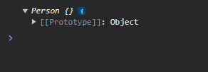

### 5.2. Function is called and we will use `this` keyword in our favour.

```
const Person = function (firstName, birthYear) {
// Instance properties
  this.firstName = firstName;
  this.birthYear = birthYear;
};

const samiul = new Person("Samiul", 1991);
console.log(samiul);
```

So, in 5.1 scenario what was the `this` key output?
**an empty object.**

```
console.log(this)
```

```
Person {}
```

That means `this` keyword inside person constructor refers to an empty object when first program run.

Now we will add two properties to that empty object `{}` `firstName` and `birthYear` by using `this` keyword because `this` refers to the empty object previously. Empty object created when we use `new` keyword and create a new object from the `Person()` constructor. Now `this` keyword has two new properties called `firstName` and `birthYear`.

**`firstName` and `birthYear` are the **instance properties**.
That means firstName and birthYear will be available to all the instance that we create from `Person()` constructor.**

### 5.3. Function will automatically return the object {}

Then the object which was created first will be returned.

Now `Person()` constructor function will be used to create as many object we want. Now `Person()` is working like blueprint of the hoise. Each of the object is created by using this blueprint will be actual house. Like:

```
const Person = function (firstName, birthYear) {

  // Instance properties
  this.firstName = firstName;
  this.birthYear = birthYear;

};

const samiul = new Person("Samiul", 1991);

//creating multiple objects using constructor function
const abbu = new Person("Rezaul", 1965);
const borshon = new Person("Borshon", 2005);

console.log(samiul);
console.log(abbu);
console.log(borshon)
```

here `samiul`, `abbu`, `borshon` are the real objects with actual data in them.

Output:

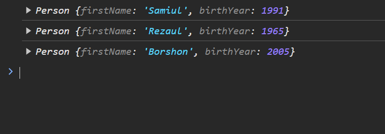

Previously mentioned that we create object from class but here we technically didn't create object from class. Because JavaScript doesn't has any class in the sense of traditional OOP. **But we create objects from a constructor function.**

Constructor function is being used to simulate classes from the beginning of JavaScript. So, `samiul`, `abbu`, `borshon` is instance of `Person()`.

To test that:

```
const Person = function (firstName, birthYear) {

  // Instance properties
  this.firstName = firstName;
  this.birthYear = birthYear;
};

const samiul = new Person("Samiul", 1991);

//creating multiple objects using constructor function
const abbu = new Person("Rezaul", 1965);
const borshon = new Person("Borshon", 2005);

console.log(samiul);
console.log(abbu);
console.log(borshon);

const ammu = "Ruma";

// check the instance of object
console.log("Samiul is instance of Person", samiul instanceof Person); // true
console.log("Ammu is instance of Person", ammu instanceof Person); //false
```

Output:

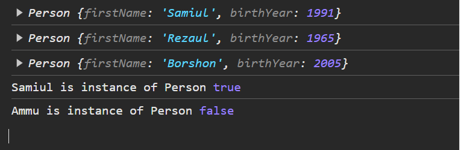

`ammu` is not instance of `Person()` constructor . So it is showing false.

We never create function in constructor. Because if we create thousands or more object using this `Person()` constructor those objects will carry this `calcAge()` method with them. 1000 objects == 1000 copies of `calcAge() ` method which will make performance issue. **Rather we will create prototype function.**

```
const Person = function (firstName, birthYear) {
  // Instance properties
  this.firstName = firstName;
  this.birthYear = birthYear;

  // never do this.
  this.calcAge = function () {
    console.log(2037 - this.birthYear);
  };
};
```

### **1. Adding or removing properties**

There are two ways of adding properties in Constructor. One in using

```function Circle(radius) {
this.radius = radius;
this.draw = function () {
console.log("draw");
};
}
const circle = new Circle(10);
// 1st one
circle.location = { x: 1 };
const propertyName = "center location";
// 2nd one
circle[propertyName] = { x: 1 };
```

we use brackets when we use property names with **-** or **space** between them like **'center-location'** or **'center location'**. Because we simply can not use

```
circle.center-location
//or
circle.center location
```

because it will give error or show undefined.

To remove properties we use

```
delete circle["location"];
```

<br>

### **2. To get all the keys in an object**

To get all the keys from an object we can use either **for loop** or **Object.keys(objectName)**

```
function Circle(radius) {
  this.radius = radius;
  this.draw = function () {
    console.log("draw");
  };
}
const circle = new Circle(10);

for (let key in circle) {
  if (typeof circle[key] !== "function") console.log(key, circle[key]);
}

const keys = Object.keys(circle);
console.log(keys);
```

<br>

### **3. Abstraction**

### _Abstraction means hiding the details and complexity and showing the essentials. Abstraction means hiding the implementation details from the consumer of the object._

```
function Circle(radius) {
  this.radius = radius;

  this.defaultLocation = { x: 0, y: 0 };

  this.computeOptimumLocation = function () {
    /// ... suppose we will do something here
  };

  this.draw = function () {
    this.computeOptimumLocation();

    console.log("draw");
  };
}
const circle = new Circle(10);
circle.draw();

```

for example if I write

```
circle.defaultLocation = false;
```

then the default location will be modified which is actually this:

```
this.defaultLocation = { x: 0, y: 0 };
```

We don't want that. We don't want to change the default location get modified by the consumer of the object. I mean we want to put a restrictions on changing default location by anyone. Another example is that suppose we use a para meter in computeOptimum function like this,

From:

```
  this.computeOptimumLocation = function () {
    /// ... suppose we will do something here
  };
```

To,

```
  this.computeOptimumLocation = function (factor) {
  /// ... suppose we will do something here
};
```

then if we need to use

```
circle.computeOptimumLocation(0.1)
```

we need to pass parameter there. And this must be done every places where we use this function `circle.computeOptimumLocation()`

now if I make it hide from the outside consumer of the object and I make it accessible in

```
  this.draw = function () {
    this.computeOptimumLocation(0.1);

    console.log("draw");
  };
```

then I just need to change it inside the constructor. So, this is abstraction to hide the implementation details from the consumer of the object.

<br>

### **4. Private Properties**

So how can we make those properties private so that we can restrict to use it outside of the constructor. We can do it by making the properties available in local scope but restrict it using in global scope.

```
function Circle(radius) {
  // Public member
  this.radius = radius;

  // Private member
  let defaultLocation = {};
}
```

here we use let so that it can be access only on Circle constructor, not outside of the Circle constructor.

<br>

### **5. Getters and Setters**

There will be some scenario where we need to use our private properties in our code or need to update our private properties in somewhere in our code. How should we access our private properties then?

Then we will use getters and setters. These getters and setters will be written inside our constructor and then we can call the getters and setters and these getters and setters then will update our private properties inside of our constructor.

```
function Circle(radius) {
  // Public member
  this.radius = radius;

  // Private member
  let defaultLocation = {};
}

// To define a getter/setter, use Object.defineProperty():

Object.defineProperty(this, "defaultLocation", {
  get: function () {
    return defaultLocation;
  },
  set: function (value) {
    defaultLocation = value;
  },
});
```

<br>

### **6. Inheritance**

**Inheritance in OOP means inherit something from the parent class**. For example in these above example assume that we created a class named

```
function Circle(){
  ///...
}
```

but what if we create another class named

```
function Square(){
  // ...
}
```

Then we may need to re-write same functionalities in both classes. That means we may need to write redundant code which is not optimal for a project. So to reduce redundancy , to reduce the re-writing of the code we can create a parent class named

```
function Shape(){
  // ...
}
```

In ` function Shape(){}` class there will be some common functionalities which should be used in both ` function Circle(){}` class and `function Square(){}` class. So here both **"Circle"** class and **"Square"** class will inherit the functionalities from its parent which is "Shape" class. So this is how we will be able to reduce the redundancy of our code. This is called **"Inheritance"** in object oriented programming or OOP.

### **But in JavaScript we don't have class, we only have objects. How can we do that inheritance not using classes but using only objects?**

### _Here comes the concept of **Prototype** and **Prototypical Inheritance**._

### 6.1. Prototype

**Prototype is an regular object in the memory. Every object has a prototype or a parent except the root object**
For example in the above examples of ` function Circle(){}` and ` function Square(){}` we consider a parent class called ` function Shaped(){}`. **Similarly in objects there is a parent object of both circle and square object. We called it Prototype.** Here prototype object is **Shaped** and it will have the common functionalities of both **Circle** object and **Square** object.
**Whenever you hear the word "Prototype" just think it as a parent. So, every object in JavaScript has a prototype object except only one object (parent object/prototype object itself). Every object in Javascript which has prototype object as its parent inherit the functionalities of prototype object.**
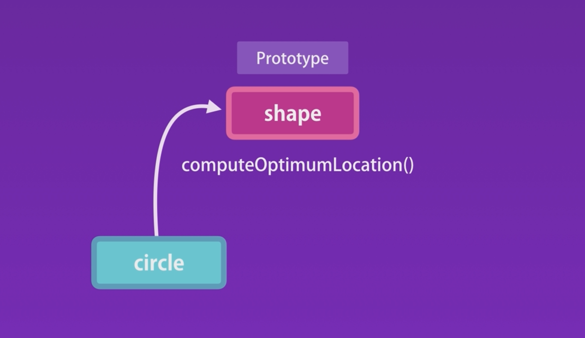

Let us consider an object called ` let x = {}`

```
let x = {}
console.log(x)
=>{}
    [[Prototype]]: Object
      constructor: ƒ Object()
      hasOwnProperty: ƒ hasOwnProperty()
      isPrototypeOf: ƒ isPrototypeOf()
      propertyIsEnumerable: ƒ propertyIsEnumerable()
      toLocaleString: ƒ toLocaleString()
      toString: ƒ toString()
      valueOf: ƒ valueOf()
......
```

When we log the `x={}` object we see the `[[Prototype]]: Object` object which is the parent object of `x={}` object. We can also see the properties of the prototype object like **constructor**. So every object has an constructor function. Constructor is the function which reference the function that was used to construct or create that object that means constructor is the reason for creating object `x={}`. **So, every object we create in javascript directly or indirectly inherit from object base. Object base is the root of all object in javascript and it does not have a prototype.**

Like below: (It is a prototype object. It doesn't have parent object or base object)

```
[Prototype]: Object
    constructor: ƒ Object()
    hasOwnProperty: ƒ hasOwnProperty()
    isPrototypeOf: ƒ isPrototypeOf()
    propertyIsEnumerable: ƒ propertyIsEnumerable()
    toLocaleString: ƒ toLocaleString()
    toString: ƒ toString()
    valueOf: ƒ valueOf()
```

See here it is a prototype object. but this object does not has any prototype for itself or we may say parent object or base object for itself.
**The conclusion is prototype object in JavaScript does not has any prototype object as parent but other than that all other object in javascript has a prototype object as parent object.**

For example if we create another object named **y** like this:

```
const y = {}
```

and we `console log(y)` what we will see?

As we learn that it is not a prototype object so this `y={}` object should has an prototype object as its parent.
so the output will be like this:

```
console.log(y)
=> {}
    [[Prototype]]: Object
      constructor: ƒ Object()
      hasOwnProperty: ƒ hasOwnProperty()
      isPrototypeOf: ƒ isPrototypeOf()
      propertyIsEnumerable: ƒ propertyIsEnumerable()
      toLocaleString: ƒ toLocaleString()
      toString: ƒ toString()
      valueOf: ƒ valueOf()
...
```

Now how to get the prototype object of any JavaScript object. For example to get the prototype of an object of `x={]` we use `Object.getPrototypeOf(x)` like this:

```
console.log(Object.getPrototypeOf(x))
=>  constructor: ƒ Object()
    hasOwnProperty: ƒ hasOwnProperty()
    isPrototypeOf: ƒ isPrototypeOf()
    propertyIsEnumerable: ƒ propertyIsEnumerable()
    toLocaleString: ƒ toLocaleString()
    toString: ƒ toString()
    valueOf: ƒ valueOf()
    ...
```

Now if we `console.log()` to check if both object `x={} ` and object `y={}` prototypes are same, what will be the output?

```
console.log(Object.getPrototypeOf(x) === Object.getPrototypeOf(y))
==> true
```

### 6.2. Prototypical Inheritance

If we see our previous example what was the `x={}` object? It was like this:

```
const x={}
```

So, is there any property like `toString()` inside object `x={}`? Answer is **no**.

But what if we write `x.toString()` , what we will get?

```
x.toString()
=> [object Object]
```

So, we have not defined any `toString()` method inside object `x={}`. But still how can we able to access it?

The reason behind is that **when we access a property or a method on an object, Javascript engine first look for that property or method first on the object itself** here object `x={}`. **But when it doesn't find it inside object `x={}` then it starts looking for it in its prototype object or we can say that it check in parent object or base object,** all the way up to the root object which we call **objectBase**. Therefore, when we call `x.toString()` first it looks for it in `x={}`. When Javascript engine doesn't find it there it looks for it in its parent object or prototype object. That is how prototypical inheritance works in JavaScript.
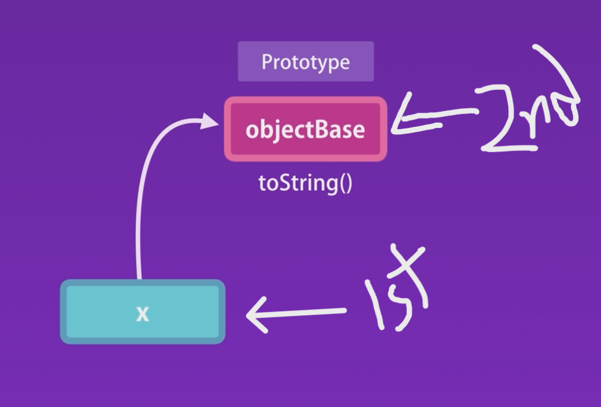

### 6.3. Multilevel Inheritance

Let's start with an example,

```
 let myArray = [];
 console.log(myArray)
   []
     length: 0
     [[Prototype]]: Array(0)
       at: ƒ at()
       concat: ƒ concat()
       constructor: ƒ Array()
       every: ƒ every()
       filter: ƒ filter()
       find: ƒ find()
       findIndex: ƒ findIndex()
       findLast: ƒ findLast()
       findLastIndex: ƒ findLastIndex()
       forEach: ƒ forEach()
       includes: ƒ includes()
       indexOf: ƒ indexOf()
       join: ƒ join()
       length: 0
       map: ƒ map()
       pop: ƒ pop()
       push: ƒ push()
       reduce: ƒ reduce()
       reverse: ƒ reverse()
       slice: ƒ slice()
       sort: ƒ sort()
       splice: ƒ splice()
       toLocaleString: ƒ toLocaleString()
       toReversed: ƒ toReversed()
       toString: ƒ toString()
       ...
       [[Prototype]]: Object
```

All these methods are defined in this object which is **[[Prototype]]:**, we can say that **this is the parent of all arrays is JavaScript.**

But there is another prototype inside of the myArray's parent or prototype of myArray.

```
myArray --> Prototype (ArrayBase) --> Prototype (ObjectBase)
```

### we can see there is an another prototype inside this array prototype.

```
[[Prototype]]: Object
```

If we expand it we get,

```
[[Prototype]]: Object
  constructor: ƒ Object()
  hasOwnProperty: ƒ hasOwnProperty()
  isPrototypeOf: ƒ isPrototypeOf()
  propertyIsEnumerable: ƒ propertyIsEnumerable()
  toLocaleString: ƒ toLocaleString()
  toString: ƒ toString()
  valueOf: ƒ valueOf()
```

So the hierarchy is like this:

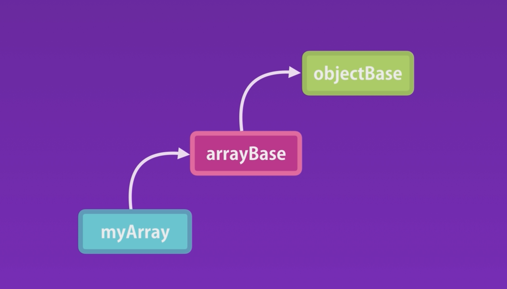

### For Object:

```
function Circle(radius) {
  this.radius = radius;

  this.draw = function () {
    this.computeOptimumLocation(0.1);

    console.log("draw");
  };
}

const circle = new Circle(10);
```

What if we `console.log(circle)`?

```
console.log(circle)
draw: ƒ ()
radius: 10
[[Prototype]]: Object
```

Here we get `[[Prototype]]: Object` for the circle object.

If we expand this `[[Prototype]]: Object` we will again get `[[Prototype]]: Object` inside `[[Prototype]]: Object`:

```
[[Prototype]]: Object
  constructor: ƒ Circle(radius)
    [[Prototype]]: Object
      constructor: ƒ Object()
      hasOwnProperty: ƒ hasOwnProperty()
...
```

So what is happening?

Here **circle** object is inherited from **circleBase** parent object and circleBase is inherited from **objectBase** parent object.

Here every time we call this `new Circle()` constructor to create a new circle object, this constructor create a new object **(circle)**. This new object **(circle)** has its own parent object which we call **circleBase**. So **circleBase** is the parent object of **circle** object that we created from `Circle()` constructor. **When we create this circle object from `Circle()` constructor it creates a parent object and set its prototype property to circleBase**

Objects created by a `Circle()` constructor will have the same prototype.

**So all circle object created by the `Circle() ` constructor will have the same prototype and all arrays created by the array constructor will have the same prototype.**


### **7. Prototype vs Instance Members**

There are two types of methods and properties in JavaScript.

1. Instance Properties or Methods
2. Prototype Properties or Methods

We can create a prototype method.

First of all, what is instance?

```
function Circle(radius){
  //Instance members
  this.radius = radius;
  this.draw = function(){
    console.log('draw')
  }
}
```

Here `radius` and `draw()` method is an instance of the `Circle` constructor.

Now if we create 100x of object from `Circle()` constructor it will consume more memory. So, we will now convert the draw method to a prototype method.

```
function Circle(radius) {
  //Instance members
  this.radius = radius;
}

//Prototype members
Circle.prototype.draw = function () {
  console.log("draw");
};

const circle = new Circle(10);
console.log(circle.draw) // Output: draw
```

here we can access the prototype of Circle constructor by using `Circle.prototype` . So, we can add the draw method in Circle constructor prototype by adding `Circle.prototype.draw`.

### We can also overwrite default prototype object.

```
const y = {}
console.log(y)
=> {}
    [[Prototype]]: Object
      constructor: ƒ Object()
      hasOwnProperty: ƒ hasOwnProperty()
      isPrototypeOf: ƒ isPrototypeOf()
      propertyIsEnumerable: ƒ propertyIsEnumerable()
      toLocaleString: ƒ toLocaleString()
      toString: ƒ toString()
      valueOf: ƒ valueOf()
```

What if we want to change the default prototype object `toString` here.

```
Circle.prototype.toString = function () {
  return "Circle with radius " + this.radius;
};
```

So, whenever we call `toString` as a rule Javascript engine will search for `toString` in object itself. There we define our new `toString` method. So it will not go to the upper hierarchy or parent object or we may say baseObject of circle object.

**_But it is not good practice to modify built-in object_**

### **8. Iterating Instance and Prototype**

```
function Circle(radius) {
  //Instance members
  this.radius = radius;
}

//Prototype members
Circle.prototype.draw = function () {
  console.log("draw");
};

const circle = new Circle(10);
```

**1. Returns instance members**

```
console.log(Object.keys(circle)); // Output: ['radius']
```

**2. Returns all members (instance + prototype)**

```
for (let key in circle) {
  console.log(key); // radius, draw
}
```
